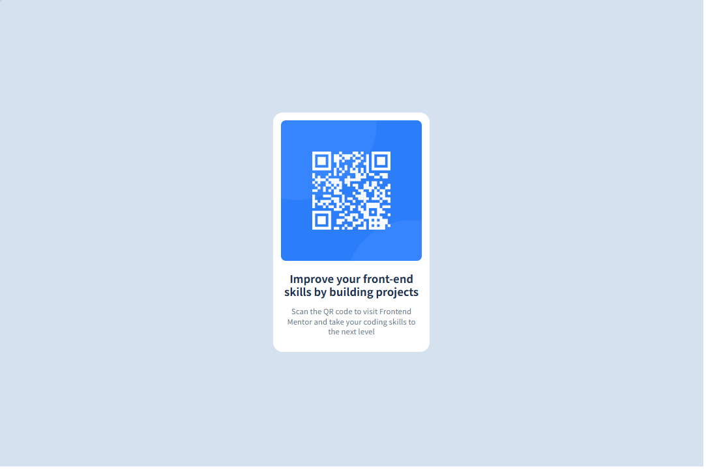

# Frontend Mentor - QR 二维码组件解决方案

这是针对[Frontend Mentor 上的 QR 二维码组件挑战](https://www.frontendmentor.io/challenges/qr-code-component-iux_sIO_H) 的解决方案。

Frontend Mentor 挑战通过构建实际项目帮助你提升编程技能。

## 目录

- [概览](#概览)
  - [截图](#截图)
  - [链接](#链接)
- [实现过程](#实现过程)
  - [使用的技术](#使用的技术)
  - [我学到了什么](#学到了什么)
  - [未来可以继续优化的方向](#未来可以继续优化的方向)

## 概览

### 截图

#### pc端



#### 移动端


你可以在 `images` 文件夹中查看项目截图或实际效果图。

### 链接
- 在线演示： https://regliya.github.io/qr-code/
## 实现过程

### 使用的技术

* 语义化 HTML5 标签
* CSS 自定义属性（CSS Variables）
* Flexbox 布局
* 响应式设计（移动端优先）
* 自定义字体引入（Outfit）
* CSS 重置与全局样式规范化

### 学到了什么

通过这个项目，我更加熟悉了以下内容：

* 如何使用 `@font-face` 引入自定义字体，并设置备用字体栈
* 如何通过 CSS 变量（`:root`）统一管理颜色、间距和字体，便于维护
* 如何使用 Flexbox 实现水平和垂直居中
* 如何编写响应式布局，从移动端（375px）扩展到桌面端（1440px）
* 如何使用 CSS 重置来确保跨浏览器样式一致性

以下是一些关键代码片段:

```css
:root {
  --Slate-900: #1F314F;
  --Slate-500: #68778D;
  --Slate-300: #D5E1EF;
  --White: #FFFFFF;
  --spacing-500: 40px;
  --font-family: 'Outfit', sans-serif;
}

@font-face {
  font-family: 'Outfit';
  src: url('./fonts/Outfit-Regular.ttf');
}

.text-preset-1 {
  font-family: var(--font-family); 
  font-weight: bold;         
  font-size: 22px;           
  line-height: 1.2;          
  letter-spacing: 0px;
  color: var(--Slate-900);   
}
```

```css
.container {
    width: 100%;
    max-width: 375px;
    height: 750px;
    background-color: var(--Slate-300);
    display: flex;
    justify-content: center;
    align-items: center;
}

@media (min-width: 1440px) {
    .container{
        max-width: 1440px;
        height: 960px;
    }
}
```

### 未来可以继续优化的方向

* 可以考虑使用其他响应式设计实现
* 可以进一步优化字体加载策略，提升网页性能
